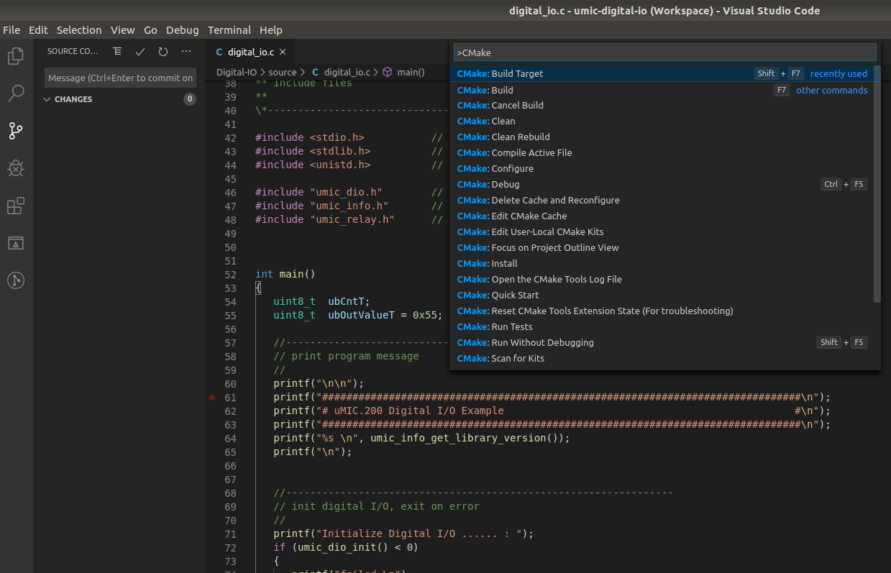
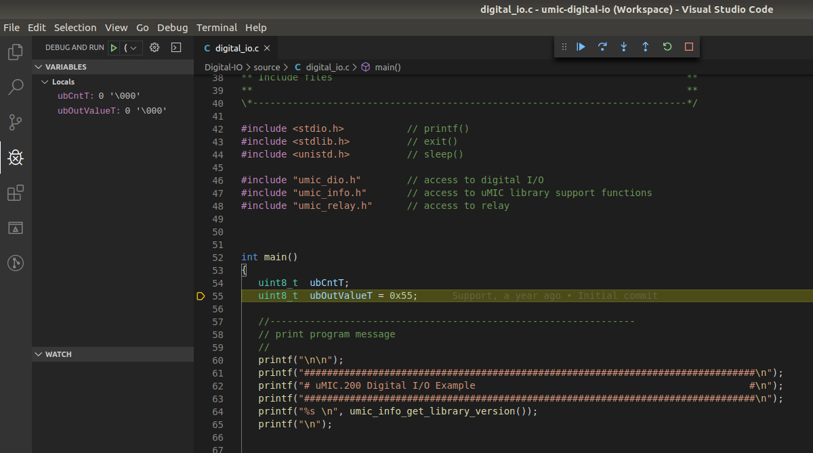

# **Digital-IO** Example

This example provides an example for access to the digital I/O peripherals. It switches
the relay as well as the digital outputs. Progress of the operation is printed to the
console.


```
umic@uMIC:~$ ./digital-io 


###############################################################################
# uMIC.200 Digital I/O Example                                                #
###############################################################################
umic library, Version 2.02.0, build on Apr 18 2019 at 11:47:43 

Initialize Digital I/O ...... : done 
Switch relay on ............  : done 
Configure all pins as output  : done 
Write output pattern ........ : AAh
Write output pattern ........ : 55h
Read input value ............ : 55h - match
Write output pattern ........ : AAh
Write output pattern ........ : 55h
Read input value ............ : 55h - match
Write output pattern ........ : AAh
Write output pattern ........ : 55h
Read input value ............ : 55h - match
Write output pattern ........ : AAh
Write output pattern ........ : 55h
Read input value ............ : 55h - match

Switch relay off ............ : done 
Release Digital I/O ......... : done 

```
 

## How to build

Open the project inside Visual Studio Code and select `CMake: Build Target`
from the Command Palette (`STRG + Shift + P`). As alternative you can press
`Shift + F7`. 



## How to run

Copy the program to the µMIC.200 controller by selecting `Terminal -> Run Task...`
from the menu. Start the download by selecting `Copy program`. Open the terminal
view in Visual Studio Code (`CTRL + Shift + ´`) and connect to the µMIC.200
controller.

```
ssh umic@umic.200
./digital-io
```


## How to debug

Open the terminal view in Visual Studio Code (`CTRL + Shift + ´`) and connect to the µMIC.200
controller. Start the GDB server on the µMIC.200 controller.

```
ssh umic@umic.200
gdbserver :2345 ./digital-io
```


Select `Debug -> Start Debugging` from the menu or press `F5`. The debugger will start and
set a breakpoint at the first code line of the program.


